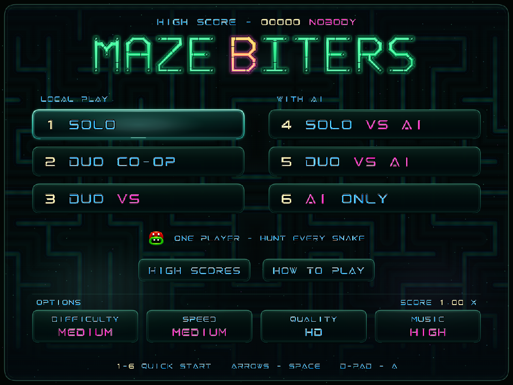
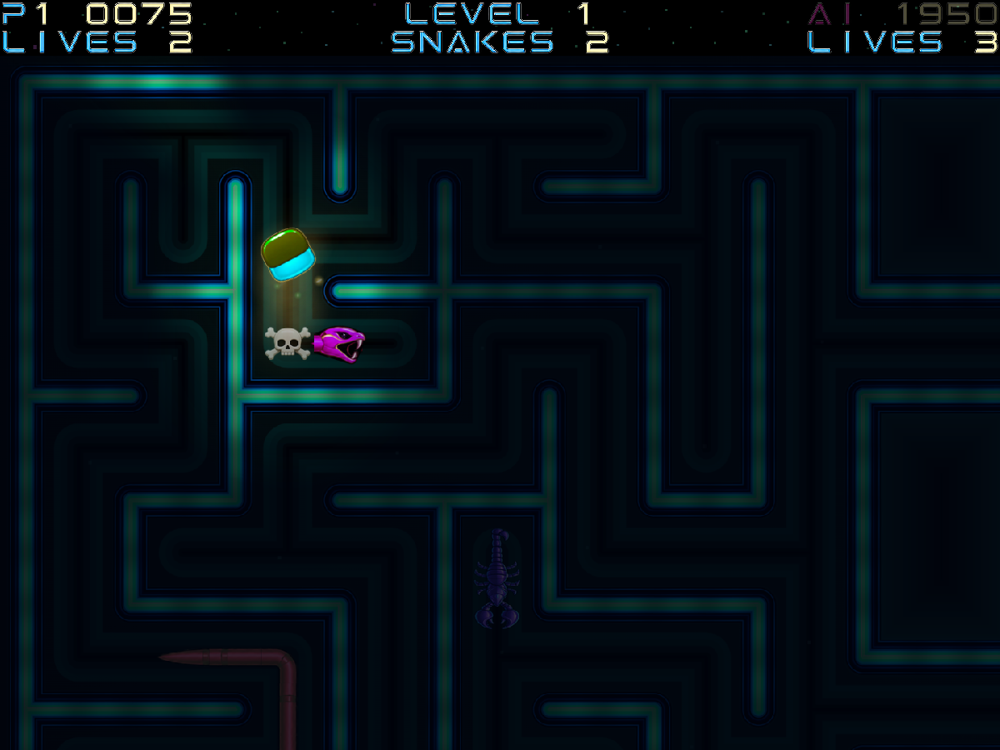

# Maze Biters

**Хапи. Избягвай. Оцелявай.**

Неонова аркадна игра в лабиринт, в която преследваните създания могат да
подгонят и теб. Догони змийската опашка, раздели тялото на самостоятелни
противници, отскочи от опасна глава и намери следващия изход, преди да те притиснат.

[**Играй в браузъра**](https://tcherkin.github.io/maze-biters/) ·
[English](README.md) ·
[Техническо ръководство](docs/TECHNICAL.md) ·
[Съобщи за проблем](https://github.com/tcherkin/maze-biters/issues)

**Текуща игра: v1.01.93.00** · За браузър · Локална мултиплейър игра · Canvas 2D



## Накратко

- **Шест начина за игра:** Solo, Duo Co-op, Duo VS, Solo VS AI, Duo VS AI и AI Only.
- **Живи змии:** хапи опашки, разделяй тела, следи посоката на главата и реагирай на отстъплението.
- **Магнитен рикошет:** автоматичният отскок ти дава шанс да избегнеш смъртоносна среща.
- **Атмосфера DUSK:** меки фенери разкриват притъмнения неонов лабиринт; Power Mode увеличава обсега им.
- **Аркадно усещане:** светещи следи, ярки образи на водача по точки, искри и цветни ефекти при ухапване.
- **Обучение в седем страници:** тринадесет повтарящи се демонстрации с истинските движения и ефекти от играта.
- **Топ 25:** имена до десет знака, изписани със собствения пикселен шрифт на играта.
- **HD и 4K:** оригинална графика в две резолюции, плавна обща камера и управление с клавиатура, мишка, докосване или геймпад.
- **20 музикални теми:** за менюто, за рекордите и осемнадесет редуващи се композиции за нивата.

> **Статус на класацията:** публичната версия засега записва резултатите в твоя браузър.
> Все още няма обща онлайн класация. Връзката към уеб API е подготвена;
> споделеният сървър и базата данни предстои да бъдат пуснати.

## Съдържание

[Как да започнете](#как-да-започнете) · [Режими на игра](#режими-на-игра) ·
[Управление](#управление) · [Битки и оцеляване](#битки-и-оцеляване) ·
[Обитатели и сили](#обитатели-и-сили) · [Точкуване](#точкуване) ·
[Класация](#класация) · [Обучение How to Play](#обучение-how-to-play) ·
[Светлина и камера](#светлина-и-камера) · [Музика и звук](#музика-и-звук) ·
[Локално стартиране](#локално-стартиране) · [Разработка](#разработка) ·
[Автор и произход](#автор-и-произход)

## Как да започнете

Отворете [Maze Biters](https://tcherkin.github.io/maze-biters/) и изберете режим.
За първа игра оставете **DIFFICULTY** и **SPEED** на **MEDIUM** и изберете **SOLO**.
Ако искате първо да видите всяка механика в действие, отворете **HOW TO PLAY**.

Целта е да **премахнете всички змии**, включително новите, получени при
разделяне на тяло. Скорпионите и ловците създават допълнително напрежение,
но не участват в брояча за завършване на нивото.

Три полезни навика:

1. Насочете се към опашка, преди да опитвате атака срещу глава.
2. Изберете следващата посока отрано: задържаният завой се изпълнява, щом се отвори проход.
3. Оставяйте си изход. Рикошетът дава време за реакция, а не постоянна безопасност.

Информационната лента показва точките и животите на всеки играч, текущото
ниво и броя на останалите змии. Разделянето на тяло може да увеличи този брой.

## Режими на игра

| Клавиш | Режим | Участници | Контакт между играчите |
| --- | --- | --- | --- |
| `1` | **SOLO** | Един човек | Няма друг играч |
| `2` | **DUO CO-OP** | Двама съотборници | Не могат да се изяждат; заетите клетки блокират движението |
| `3` | **DUO VS** | Двама съперници | Правила за състезателен контакт |
| `4` | **SOLO VS AI** | Един човек и съперник с изкуствен интелект | Правила за състезателен контакт |
| `5` | **DUO VS AI** | Двама души и съперник с изкуствен интелект | Всеки играе срещу останалите |
| `6` | **AI ONLY** | Самостоятелна игра на изкуствения интелект | Наблюдение на симулацията; без запис в класацията |

Мултиплейърът е **локален, на един общ екран**, без онлайн намиране на съперници.
P1 е зелен, P2 е пурпурен, а AI е син. Портретите в менюто използват същите
образи и са обърнати към съответните партньори или противници.

В кооперативния режим точките и животите остават отделни. Светещият образ
на водача по точки се появява и тук, но служи само за отличаване:
той никога не позволява изяждане на съотборника.

## Управление

### В лабиринта

| Вход | Действие |
| --- | --- |
| P1: `W A S D` | Нагоре, наляво, надолу, надясно |
| P1: `I J K M` | Класическа подредба: I нагоре, J наляво, K надясно, M надолу |
| Стрелки | P2 в режимите с двама души; P1, когато човекът е само един |
| Кръстче / ляв стик на геймпад | Движение; първият свързан геймпад управлява P1, вторият — P2 |
| Щракване / докосване на коридор | Насочва човешки играч по маршрут към избраното място |
| `P` | Пауза / продължаване |
| `Esc` | Прекратява играта; повторно натискане по време на GAME OVER пропуска анимацията |

Движението продължава, докато не бъде блокирано. Задръжте посока преди
разклонение, за да подготвите завоя. Две задържани перпендикулярни посоки
позволяват стъпаловидно придвижване, когато коридорите го допускат;
героят никога не минава по диагонал през стена.

Мишката и докосването избират живия човешки играч с **най-краткия достъпен
маршрут през лабиринта**, а не просто най-близкия на екрана. При достигане
на целта героят продължава напред; щракването не е команда за спиране.

### Менюта и обучение

Местете избора със **стрелките** или **кръстчето/левия стик**, а потвърждавайте
с **Space/Enter** или **A/Start на геймпада**. Мишката и докосването избират
бутоните директно. Бутон B връща назад от подменютата; обучението има и
**Esc**, както и видим бутон **EXIT**.

Главното меню предлага преки клавиши **1–6**, **HIGH SCORES**,
**HOW TO PLAY** и долен ред с **DIFFICULTY**, **SPEED**, **QUALITY** и **MUSIC**.

### Клавишна команда за тестване

По време на игра две цифри избират ниво: `01`–`99`, а `00` означава ниво 100.
Точките, животите и режимът се запазват. **Тези игри засега не са изключени
от локалната класация**, затова тя не бива да се приема за проверено състезание.

## Битки и оцеляване

### Следете змията, не само цвета ѝ

| Контакт | Резултат |
| --- | --- |
| Опашка | Изяжда се един сегмент |
| Средата на тялото | Ухапаният сегмент изчезва; останалото се превръща в две змии |
| Глава на змия с тяло, достигната отзад без Power Mode или щит | Премахва се цялата змия |
| Глава на змия с тяло, достигната отпред или отстрани без защита | Опасно |
| Самотна глава, достигната отстрани или отзад | Може да се изяде безопасно |
| Самотна глава, достигната отпред без защита | Опасно |
| Глава при активен Power Mode или защитен щит | Главата се изяжда; останалото тяло се обръща и става нова змия |

След разделяне или ухапване на глава със защита старата опашка може да стане
**нова глава**. Краят, който допреди малко е бил безопасен, може вече да е опасен.

### Магнитен рикошет

Жив човешки играч без Power Mode или защитен щит реагира автоматично на
съседна смъртоносна змийска глава или ловец с отскок назад. Това работи
при управление с клавиатура, геймпад, мишка и докосване.

Първата стъпка назад е задължителна. След нея задръжте безопасна перпендикулярна
посока, за да поемете по първия отворен страничен проход. В противен случай
отскокът следва правия коридор, докато бъде блокиран; не завива автоматично.

**Рикошетът не дава неуязвимост.** Стена зад вас, препятствие по пътя назад,
пропуснат страничен проход или друга приближаваща опасност могат да ви
оставят в капан. Стоенето на място дава време на създанията да ви настигнат.

### Дуели: кой кого може да изяде?

Контактът между съперници се решава в следния ред:

1. **Защитен щит:** защитен играч не може да бъде изяден. Защитен нападател
   надделява над незащитен съперник; двама защитени играчи се блокират взаимно.
2. **Power Mode:** ако щит не решава срещата, играчът с активен Power Mode
   надделява над този без него.
3. **Точки:** при еднакво състояние на Power Mode печели играчът с повече показани точки.
4. **Равенството блокира:** еднакви точки и еднакво състояние на Power Mode не дават победител.

Контурът на водача, светещото му ядро Charged Core и искрите отличават
лидера по точки, **но не дават безусловно право на атака**. Силата или
щитът на противника могат да отменят предимството в точките.
DUO CO-OP изцяло изключва изяждането между играчи.

### Животи и възстановяване

Започвате с **три живота**. Всеки **5 000 натрупани точки** носи още един
живот до максимум **девет**. Праговете, достигнати при девет живота,
не се пазят за по-късно.

След анимацията на смъртта играчът се възстановява, когато началната му клетка
е свободна. Временен щит се получава при започване на игра, при възстановяване
и при влизане в ново ниво. Той трае **20 нормални стъпки на змията** —
4,36 игрови секунди — и осигурява защита в битка без ускорение.

## Обитатели и сили

**Змиите** се движат с редуващи се импулси на главата и опашката, могат да
отстъпват с опашката напред, помнят нападателите и реагират на ухапвания
и разделяне. Цветовете им се запазват при разделяне. С напредването на нивата
обитателите стават по-трудни за преодоляване; характерното пулсиращо движение
на змиите е умишлено запазено.

**Скорпионите** заемат две клетки, обикалят коридорите, оставят плодове и снасят
яйца. Винаги могат да се изядат безопасно, но това озлобява вече излюпените им ловци.

**Яйцата** първоначално са проходими. След десет игрови секунди започват
трисекундно напукване и стават препятствия, а после от тях се излюпват ловци.
Ако клетката е заета, напукването се отлага, вместо под друг обект внезапно
да възникне твърдо препятствие.

**Ловците** активно преследват играчите. Power Mode или защитният щит
позволяват безопасното им изяждане; без тях ловците са опасни.

### Плодове и Power Mode

Всеки от четирите вида плодове дава точки и включва или подновява
**седем игрови секунди** Power Mode:

| Фаза | Продължителност | Какво се променя |
| --- | --- | --- |
| Ускоряване | 1 секунда | Плавно нарастване на скоростта; силата в битка вече е активна |
| Пълна сила | 3 секунди | До двойна скорост на движение и по-ярък фенер с по-голям обсег |
| Предупреждение / забавяне | 3 секунди | Предупредително мигане и плавно връщане към нормалната скорост |

Следващият плод **подновява** таймера до седем секунди, вместо да добавя
още седем. Скоростта остава плавна и при подновяването.

Всички тези времена се отчитат от общия игрови часовник: промяната на SPEED
променя реалното им темпо заедно с движението, появата на създания и анимацията.

## Точкуване

| Събитие | Базови точки |
| --- | ---: |
| Ухапване на сегмент от тялото / разделяне на змия | 10 |
| Изяждане на сегмент от опашката | 25 |
| Плодове от видове 1–4 | 50 / 100 / 150 / 200 |
| Изяждане на змийска глава | 125 |
| Изяждане на скорпион | 150 |
| Изяждане на ловец | 200 |
| Завършване на ниво | 500 за всеки участник в текущата игра |
| Победа над съперник | 1 000 |

**Получени точки = базови точки × множител за трудност × множител за скорост.**

| Трудност | Множител | Скорост | Множител |
| --- | ---: | --- | ---: |
| PICNIC | 0,50× | SNAIL | 0,60× |
| EASY | 0,75× | SLOW | 0,80× |
| MEDIUM | 1,00× | MEDIUM | 1,00× |
| HARD | 1,25× | FAST | 1,25× |
| BRUTAL | 1,50× | EXTREME | 1,60× |

Дробните точки се натрупват вътрешно. Показваният резултат се закръгля надолу
до кратно на пет; той се използва и за предимството между съперници,
и за записа в класацията.

Всяка нова игра започва със **случаен цвят на лабиринта**. Завършването на ниво
сменя лабиринта и музиката и създава наново неговите обитатели.
Системата от лабиринти с размер 36×25 клетки променя разположението
и сложността им с напредването на играта.

## Класация

**Топ 25** използва същия заоблен, осветен облик като главното меню.
Записите показват място, име, режим, ниво и точки. Шампионът и току-що
записаният резултат получават отделни светлинни акценти;
празната класация не съдържа измислени рекорди.

### Класиране и въвеждане на име

- **Човекът** с най-много точки в една игра може да запише положителен резултат, който влиза в класацията.
- При равенство между водещите хора се създава **един общ запис**, а не два дубликата.
- AI ONLY не участва; по-висок резултат на AI не пречи на човешкия запис.
- При пълна таблица са нужни **строго повече точки** от последното място.
- В режимите с двама души екранът за име показва **P1**, **P2** или двойката при равенство.
- **Прекратяване с Esc** също може да доведе до запис на класиращ се резултат.

Използвайте до **10 знака**, без интервали. Пишете директно, избирайте
екранните клавиши със стрелките/кръстчето или ги натискайте с мишка/докосване.
Името се изписва с пикселния шрифт на играта, а не в обикновено текстово поле.

**Enter** записва; **Backspace/Delete** премахва последния знак.
**Space** активира избран екранен клавиш само след използване на стрелките
за навигация, така че случайните интервали при писане да не добавят букви.
Видимите бутони **DELETE**, **SAVE** и **SKIP** остават достъпни.

Буквите се преобразуват в главни. Поддържат се A–Z, 0–9, апостроф, запетая,
точка, тире, @ и ?. Екранната клавиатура предлага букви, цифри и
`- . @ ?`; запетаята и апострофът могат да се въведат директно от клавиатурата.

**Празно име никога не се записва.** SKIP или Esc не оставя празно място в класацията.

### Локална сега, обща по-късно

Резултатите се пазят в локалното хранилище на този браузър. Те не са свързани
с профил и не се пренасят автоматично на друго устройство, браузър или домейн.
Изчистването на данните на сайта може да ги изтрие; поверителното сърфиране
може да ограничи запазването им.

Незадължителната връзка към уеб API е описана в
[техническото ръководство](docs/TECHNICAL.md#shared-high-score-api).
За обща надеждна класация все още са необходими работещ сървър, база данни,
проверка на резултатите и защита от злоупотреби. GitHub Pages не предоставя тези функции.

## Обучение How to Play

**Neon Training** съдържа седем страници и тринадесет автоматично повтарящи
се демонстрации. Вие избирате уроците, а героите изпълняват примерите.

| Страница | Урок |
| --- | --- |
| 1 · Move and Turn | Подгответе завой НАГОРЕ, завийте при отвора и продължете извън кадър |
| 2 · Bite the Snake | Догонете движеща се опашка; ухапете средата и вижте как се образуват две змии |
| 3 · Magnetic Ricochet | Срещнете приближаваща глава, отскочете и поемете през страничния изход |
| 4 · Fruit and Power | Изяжте скорпиона, вижте плодове, яйца и ловци, след което използвайте Power Mode |
| 5 · Danger and Escape | Пропуснете изхода, обърнете се при стената, отскочете от змията и попаднете в капан |
| 6 · Duel Priorities | Пет срещи обясняват щитовете, силата, предимството в точките и равенствата |
| 7 · Clear the Maze | Премахнете последната змия и вижте цялото празнуване на завършеното ниво |

Това са минилабиринти с валидни маршрути по клетки, които използват
**същите движения, форма на змиите, правила за ухапване и разделяне,
анимация, осветление и ефекти като истинската игра**.
Симулацията им е отделена от вашата игра и резултати.

Темпото е забавено за по-лесно проследяване, с време за прочит в началото,
кратко задържане на резултата и плавни преходи между демонстрациите.
Подсказките за посока са полупрозрачни мигащи клавиши над действието,
а не предмети, които героят може да изяде.

**Нагоре/надолу** сменя страниците; **наляво/надясно** избира PREV, NEXT или EXIT.
Потвърдете със Space/Enter или A на геймпада. Esc/B излиза веднага;
последната страница предлага и **PLAY SOLO**. Надписите и навигацията се
предоставят и чрез ARIA описание за помощни технологии,
макар че играта остава предимно визуална.

## Светлина и камера



### Атмосферата DUSK

Лабиринтът остава слабо видим в тъмнината. Всеки жив играч, включително AI,
има мек ореол и насочен фенер с плавно затихващи краища.
Светлините се съчетават в мултиплейър и следват движението на героите и камерата.

При пълна сила Power Mode увеличава обсега на лъча с **45%**, а околния ореол
с **30%**. Предупредителното мигане не кара фенера да проблясва.
Осветлението служи за атмосфера, а не за физическа симулация:
**стените не спират светлинните лъчи**.

DUSK присъства и в обучението и остава активен при пауза, смърт и смяна
на ниво. Видимият образ при смърт за кратко запазва собствена затихваща светлина.

### Камера, която следва движението

Камерата плавно се мести и променя увеличението в границите **1×–2×**.

- Неподвижният самостоятелен играч се вижда отблизо.
- Продължителното движение леко разширява кадъра, за да покаже маршрута напред.
- Завоите и връщането назад задържат по-близък кадър от устойчивото движение напред.
- Няколко играчи споделят кадър, който отчита и движението на всеки поотделно.
- Когато остане само един жив играч, камерата използва поведението за Solo.

Пауза, GAME OVER и преходите между нивата разширяват изгледа.
Кадрирането никога не променя сблъсъците или набора от изображения
на героите по време на приближаване.

### Ефекти и интерфейс

**Фосфорните следи** оставят мека, разсейваща се светлинна мъгла зад играчите.
**Образът на водача** съчетава фин контур на силуета със светещо ядро
Charged Core; малки искри следват движението му.
**Ефектите при ухапване** преминават от бял импулс към цветен облак,
който се прибира към устата. Подобни ефекти съпровождат изяждането
на скорпиони и вражески герои.

Интерфейсът **Dusk Arcade** пренася същата атмосфера в главното меню,
класацията, въвеждането на име и обучението: притъмнен истински лабиринт
на заден план, микрозвезди, заоблен тъмносиньо-зелен релеф, мека светлина
около избраното и светлинни пробези по пикселните заглавия.
Десет осветени позиции за името реагират на всеки въведен знак.

## Музика и звук

Саундтракът редува настроението си с напредването на нивата:

- **Ниво 1 и нечетните нива:** случайно избрана композиция от **Neon Stillness**.
- **Четните нива:** случайно избрана композиция от **Neon Orbit**.
- Всяка колекция има **девет композиции**, разбъркани без повторение, докато
  се изчерпи собственият ѝ списък. При последователно преминаване на нивата
  се избират всички осемнадесет, преди някоя да се повтори;
  кратко ниво може да приключи, преди композицията му да е изсвирила докрай.
- Менюто има собствена постоянна тема.
- **Neon Orbit High Score** започва при въвеждане на име и продължава
  в последвалата класация. Връщането в главното меню възстановява неговата тема.
  Отварянето на HIGH SCORES директно от менюто запазва музиката на менюто.

**MUSIC** преминава през OFF, LOW, MEDIUM и HIGH. HIGH е стандартният микс;
LOW и MEDIUM използват 25% и 55% от силата му.
Настройката се запомня локално, не променя силата на звуковите ефекти
и не стартира музикалния списък отначало.

Играта има **24 звукови ефекта**, пространствено стерео и отделни звукови
сигнали за ухапвания, плодове, яйца, Power Mode и смърт.
Съвместимите геймпадове добавят и вибрации. Звукът и вибрациите зависят от
поддръжката на браузъра и устройството; ако браузърът е спрял звука,
стартирайте играта с натискане на клавиш или бутон.

## Локално стартиране

Не е нужно инсталиране на пакети или компилиране на приложението.
Подайте файловете през HTTP; отварянето на `index.html` директно от диска
може да попречи на зареждането на ресурси и звук.

Под Windows:

```cmd
.\tools\serve.cmd
```

Отворете [localhost:8080](http://127.0.0.1:8080/). По желание задайте друг порт:

```cmd
.\tools\serve.cmd 8081
```

Стартиращият файл използва Python от комплекта на Codex, когато е наличен,
а след това търси `python` или `py`. Така се избягва ограничението на
PowerShell за изпълнение на скриптове при директно стартиране на `serve.ps1`.

На друга система с Python 3 изпълнете от основната папка на хранилището:

```sh
python3 -m http.server 8080 --bind 127.0.0.1
```

Спрете сървъра с **Ctrl+C**. Ако публикувана промяна не се вижда,
презаредете страницата с изчистване на кеша. **HD** е по-лекият стандартен
режим; **4K** зарежда графика с по-висока резолюция.

## Разработка

Играта използва **Canvas 2D**, а не WebGL. Графиката, звукът, настройките,
осветлението и записът на рекорди са в отделни папки;
главният игрови код остава в `src/engine/game.js`.

| Качество | Основно изображение с информационната лента | Изходни клетки за героите |
| --- | --- | --- |
| HD | 1440×1080 | 80×80 |
| 4K | 2880×2160 | 160×160 |

Това са размерите на вътрешното изображение с пропорции 4:3;
те не означават запълване по ширина на дисплей 3840×2160.
При дробно увеличение изображенията все пак се преизчисляват за съответния мащаб.

Рендерирането използва повторно кеширани лабиринти, информационни ленти
и интерфейс, предварително създадени варианти на водача, готови светлинни
образци и ограничен брой едновременни ефекти. То изолира 104 клетки на
движещите се змии, за да не се промъкват части от съседни изображения
при дробно увеличение. Вътрешната цел е 120 Hz,
**без гаранция за такава кадрова честота на всяко устройство**.

Вижте [техническото ръководство](docs/TECHNICAL.md) за архитектурата,
кеширането, диагностиката, осемте команди за проверка, публикуването
и API за класацията.

### Какво предстои?

Планират се самостоятелен уебсайт и обща класация с проверени резултати,
последвани от по-широко тестване на устройства и подготовка за YouTube Playables.
Това са бъдещи намерения, а не вече пуснати функции или получено одобрение
от платформата. WebGL остава възможност за оценяване чрез измервания,
а не завършена миграция.

Текущите ограничения включват само локален мултиплейър, рекорди само в браузъра,
липса на запис на незавършена игра и липса на отделна класация за тестване
с прескачане на нива. Силата на музиката се запазва; другите настройки
в менюто и напредъкът засега не се запазват между сесиите на браузъра.

## Автор и произход

Maze Biters е създадена от **Георги Черкин**. Корените ѝ водят от класическата
**Hyper Viper за MSX** през неговата по-ранна **интерпретация за Palm OS**,
създадена приблизително двадесет години преди този браузърен проект.

Звуковият дизайн и първоначалните музикални композиции са на Георги.
Настоящият саундтрак е разработен със **Suno** въз основа на музиката
от по-ранната му игра. Помощ при разработката: **OpenAI Codex**.

Това хранилище съдържа по-новата игра Maze Biters.
Отделно запазената
[версия с предишната графика](https://tcherkin.github.io/hyper-viper-remastered/)
е **v0.99.49.64**, преди новите изображения на змиите.

## Права и лиценз

За проекта не е предоставен лиценз за отворен код. Публичното хранилище
не дава общо разрешение за повторно използване или разпространение на кода,
графиката, музиката и звуците. Съществуващите права и приложимите условия
на трети страни остават в сила; преди повторна употреба се свържете с автора.
